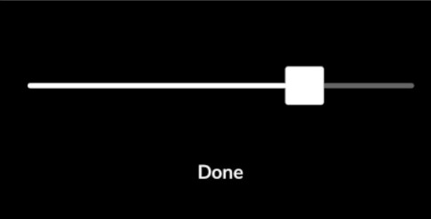

# Create a new dataset

## Data collection using a Flir camera

Use the Flir One camera and its app to record thermal images over the object of interest.
Try to avoid unwanted reflections and fingers on the images.
You can either fix the temperature range prior to the recording session or re-scale the images later.

**IMPORTANT**: Remember to also manually align the thermal image and RGB image when you record the images on the phone with the button to the left of the shutter button.
To align the image on the FLIR app, click on the icon:


And align the RGB boundaries with the thermal image using the slider:



You must use FLIR cloud service to transfer the images to your computer:

- First, select all the images and download them, this will save the MSX images in a zip file.
- Then, download one by one the RGB DC images by opening them in the gallery.
  This step is necessary to align the RGB and thermal image; using the MSX image to extract both will result in non-aligned RGB/thermal images.

Save all your MSX images to one folder named "MSX" and your RGB into another one.

## Data extraction

To process thermal images from a Flir camera, we use the [Flir Extractor Repo](https://github.com/ITVRoC/FlirImageExtractor).
It extracts raw information of the MSX images and outputs raw thermal images, RGB images, and CSV files with the exact temperature value at every pixel.

Based on the Flir extractor, we can extract our own temperature images which directly encode the temperature values in greyscale.
The images are also normalised based on the maximum and minimum temperatures of the entire dataset.

> We provide a visualiser for the greyscale images that shows the temperature value of every pixel once it's hovered on with the mouse.

To get normalised thermal images, MSX images must be in one folder without the RGB images.
Then, clone the [Flir extractor](https://github.com/ITVRoC/FlirImageExtractor) repo in your root directory.

On Fedora, make sure to install the following packages:

```bash
sudo dnf install perl-Image-ExifTool.noarch
sudo pip install numpy matplotlib pillow
```

### Extact raw data

To create the CSV files, rgb images, and the greyscale raw temperature images, run
the following command, with `<path_to_msx>` the path to the MSX images, and `<path_to_output_folder>` the path where the temperature and rgb images, and csv files extracted will be saved.

```bash
thermoscenes_preprocess_thermal --msx-images <path_to_msx> --output-folder <path_to_output_folder>
```

> If your MSX images are in more than one folder, do it for all folders, and make sure that the temperature are rescaled to the same range in the next step.

To ensure alignment of the RGB and thermal images, one must replace the extracted RGB images with the ones downloaded from the Flir cloud.

### Rescale the temperatures

It should be noted that in the FLIR app, there is an option to manually lock the temperature range when taking the photos.
Therefore, if you have locked the temperature range when taking the photos, there is no need to rescale them.

In the case eval images are not in the same temperature range as train images, you must re-scale the testing images to the training scale.
Use the `rescale_thermal_images.py` script with the temperature bounds from training and testing sets:

```bash
thermoscenes_rescale_thermal_images.py --input-folder <input_folder> --output-folder <output_folder> --t-min <t_min> --t-max <t_max> --t-min-new <t_min_new> --t-max-new <t_max_new>
```

### Split data into train and eval

Create the following folders:

- "thermal_train": put your thermal images used for training here
- "rgb_train": put the corresponding rgb image of all thermal images in "thermal_train"
- "thermal_eval": put your thermal images used for eval here
- "rgb_eval": put the corresponding rgb image of all thermal images in "thermal_eval"

Then, all files must be renamed using:

```bash
thermoscenes_rename_files --path-to-folder <path_to_folders>
```

With `<path_to_folders>` the folder that contains the four folders created earlier.
The renamed files are saved in a folder named "\<FOLDER NAME\>_processed".

> Make sure that the `temperature_bounds.json` file is included.

## Get poses with COLMAP

To run COLMAP on the dataset you created:

```bash
thermoscenes_images_to_nerf_dataset --matching_method exhaustive --thermo-scene-data <path_to_root_folder_of_dataset> --output-dir <output_folder> --num-downscales 0 --update-colmap-json
```

You should get a file named `transforms_thermal.json` that you can put in the root folder of your scene.
RGB images process with COLMAP should be saved automatically in the folder "images", and thermal images should be saved in a "thermal" folder.
You should end up with a data folder looking like:

```txt
your_scene
  |--images
    |--frame_eval_0000.jpg
    |--...
    |--frame_eval_N.jpg
    |--frame_train_0000.jpg
    |--...
    |--frame_train_N2.jpg
  |--thermal
    |--frame_eval_0000.png
    |--...
    |--frame_eval_N.png
    |--frame_train_0000.png
    |--...
    |--frame_train_N2.png
  |--msx
    |--frame_eval_0000.jpg
    |--...
    |--frame_eval_N.jpg
    |--frame_train_0000.jpg
    |--...
    |--frame_train_N2.jpg
  |--temperature_bounds.json
  |--transforms_thermal.json
```

The new scene dataset is complete.
